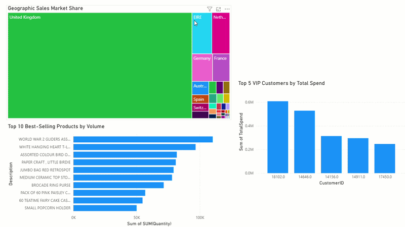

# Retail Revenue & Customer Insights Dashboard


## Project Overview
In modern e-commerce, raw transactional logs are a direct reflection of consumer behavior. To turn raw transactional logs into measurable business value, they must first be extracted from their original formats, cleaned to ensure data integrity, and structured into an optimised data model. This project simulates an enterprise analytics lifecycle. 

By building a dedicated MySQL database and connecting it to Power BI, this project uncovers critical business performance drivers, tracks global market share, isolates high-value customer segments, and analyses inventory demand to directly inform cross-functional business strategies.

## Project Structure
```
├── .gitignore                      <- Prevents tracking of temporary/local system files.
├── LICENSE                         <- MIT License detailing open-source usage permissions.
├── README.md                       <- Executive summary, technical documentation, and insights.
├── retail_analytics.sql   <- Production SQL scripts for ETL and aggregation.
├── data/                    <- Storage directory for raw data source files.
│   └── data_source_info.md
│
└── dashboard/               <- Final visualisation files and interactive assets.
    ├─ retail_analytics_dashboard.pbix
    └── retail_analytics_dashboard.gif
```
## My Dashboard 


## Data Source & Environment
**Data Source:** Online Retail Dataset (Originally sourced from the UCI Machine Learning Repository, hosted on Kaggle)
* **Dataset Scale:** ~44 MB (.csv format) containing transnational transactions spanning 31/08/2009 to 30/12/2011 .
* **Target Domain:** A UK-based, registered non-store online retail company specialising in unique all-occasion gifts.
* **Tech Stack:** * **Database Engine:** MySQL Server 8.0 & MySQL Workbench
  * **Command Line Interface:** Windows CMD (for advanced server configurations)
  * **BI & Visualisation:** Power BI Desktop

## Data Processing & SQL Engineering 
The repository contains a fully optimised SQL script designed to handle schema creation, data ingestion, data auditing, and primary business metric calculations.

### Data Ingestion Layer
A relational database table was engineered with precise data types (`VARCHAR`, `INT`, `DECIMAL`) to prevent data truncation during the ingestion of the raw transaction files.

### Business Logic Implemented:
* **Guest Checkout Identification:** Audited missing `CustomerID` attributes to evaluate guest checkout traffic versus registered user accounts.
* **Return & Cancellation Tracking:** Isolated anomalous negative values in the `Quantity` field to account for customer returns.
* **Revenue Computations:** Wrote aggregation scripts separating **Gross Revenue** (confirmed sales where `Quantity > 0`) from **Net Revenue** (all transactions factored together) to assess the bottom-line financial health.

## 🛠️ Technical Hurdles & Engineering Solutions
This section highlights the security lockdowns and configuration errors I faced during the loading data stage of my project. Overcoming these specific roadblocks was an invaluable experience, as these errors directly mirror the strict, real-world data security and infrastructure constraints I will encounter as a data analyst working in an enterprise database environment.

### Stage 1: The Roadblocks
1. **Error 1146 (Database Typo):** Experienced a syntax error due to an accidental table misspelling (`tranasctions` vs `transactions`).
   * *Key Lesson:* Always meticulously audit `FROM` and `INTO` object names when a compiler returns a "table doesn't exist" exception.
2. **Error 1290 (Security Lockdown - `--secure-file-priv`):** MySQL blocked file imports from unauthorized folders (like my standard Downloads folder) to prevent security risks.
   * *Key Lesson:* To keep things secure, databases lock down where you can import files from. You cannot just load data from your normal Downloads folder; you have to use a specific, trusted "Uploads" folder. I used the command `SHOW VARIABLES LIKE "secure_file_priv";` on the server to instantly find the exact folder path MySQL required.

### Stage 2: The Engineering Fixes
When executing an advanced `LOAD DATA LOCAL INFILE` via MySQL Workbench, a severe system error was triggered: 
> `ERROR 3948 (42000): Loading local data is disabled; this must be enabled on both the client and server sides.`

To fix this security block on both sides, I used the Windows command line to change the server settings directly:

1. **Logging into the MySQL Server via Command Prompt:** Opened the Windows Command Prompt to bypass the visual software, logging directly into the MySQL database with local file-loading permissions turned on:
   ```bash
   "C:\Program Files\MySQL\MySQL Server 8.0\bin\mysql.exe" -u root -p --local-infile
   
## Conclusion & Findings


### Key Operational Insights


### Key Technical Takeaways

